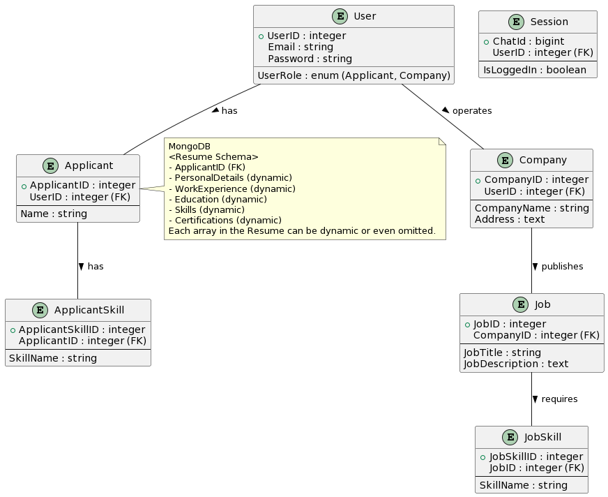

# Jobify Bot

## Overview
Jobify Bot is a Telegram bot designed to facilitate connections between job seekers and recruiters. It enables applicants to create and edit their resumes, search for and apply to jobs, while companies can post, edit, and delete job vacancies, as well as search for potential candidates.

## Features

### For Applicants
- **Create Resume**: Build a comprehensive resume.
- **Edit Resume**: Modify your current resume.
- **Search Jobs**: Browse through job listings that match your profile.
- **Matching Jobs**: Get recommendations for jobs based on your resume.

### For Companies
- **Post Job**: Announce new job openings.
- **Edit Job Listings**: Revise details of job posts.
- **Delete Job Listings**: Remove job listings that are no longer available.
- **Matching Applicants**: Find candidates that match the job requirements.

## Getting Started

## Getting Started

1. **Install Node.js**: Ensure Node.js is installed on your system.
2. **Clone the Repository**: Clone the Jobify Bot repository to your local machine.
3. **Install Dependencies**: Navigate to the project directory and run `npm install` to install all necessary dependencies.
4. **Run the Bot**: Start the bot with the command `npm start`.
5. **Access the Bot**: Open Telegram and search for [@inf2003_database_grp24_jobifyBot](https://t.me/inf2003_database_grp24_jobifyBot) to begin interacting with Jobify Bot.
6. **Demo Accounts**: For a quick start, you can use demo accounts to explore the bot's features:
   - For applicants, use `applicant@email.com` with the password `password`.
   - For companies, use `company@email.com` with the password `password`.

## Available Commands

- `/start`: Initiate the bot and view available commands.
- `/login`: Log into your account.
- `/register`: Sign up as a new user.
- `/create_resume`: (Applicants) Create a new resume.
- `/edit_resume`: (Applicants) Update your existing resume.
- `/search_jobs`: (Applicants) Search for job vacancies.
- `/matching_jobs`: (Applicants) View jobs that match your skills and experience.
- `/post_job`: (Companies) List a new job opening.
- `/edit_job`: (Companies) Edit details of your job postings.
- `/delete_job`: (Companies) Remove an existing job post.
- `/matching_applicants`: (Companies) Find candidates that fit your job requirements.
- `/logout`: Exit from the bot.

## Database Design

Jobify Bot's database incorporates both SQL and NoSQL elements. Below is a UML diagram illustrating the structure of the SQL database:

## Development

Developed using Node.js, Jobify Bot features a blend of command handlers, bot utilities, and integrated database management for SQL and NoSQL databases.

## Project Team

INF2003 Project | Database System
- Abdullah Waafi Bin Adam (2201228@sit.singaporetech.edu.sg)
- Claris Toh (2203422@sit.singaporetech.edu.sg)
- Goh Shuang Claire (2202682@sit.singaporetech.edu.sg)
- Rondon Alyssa Bulanhagui (2202487@sit.singaporetech.edu.sg)
- Sandra Choy Shu Min (2202472@sit.singaporetech.edu.sg)

Infocomm Technology Cluster, Singapore Institute of Technology, Singapore

## License
Jobify Bot is open source and available under the [MIT License](LICENSE).

## Contact
For inquiries or contributions, please reach out to the team members via their respective email addresses provided above.
